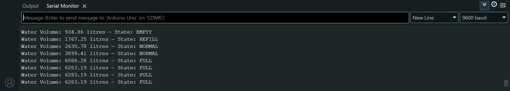
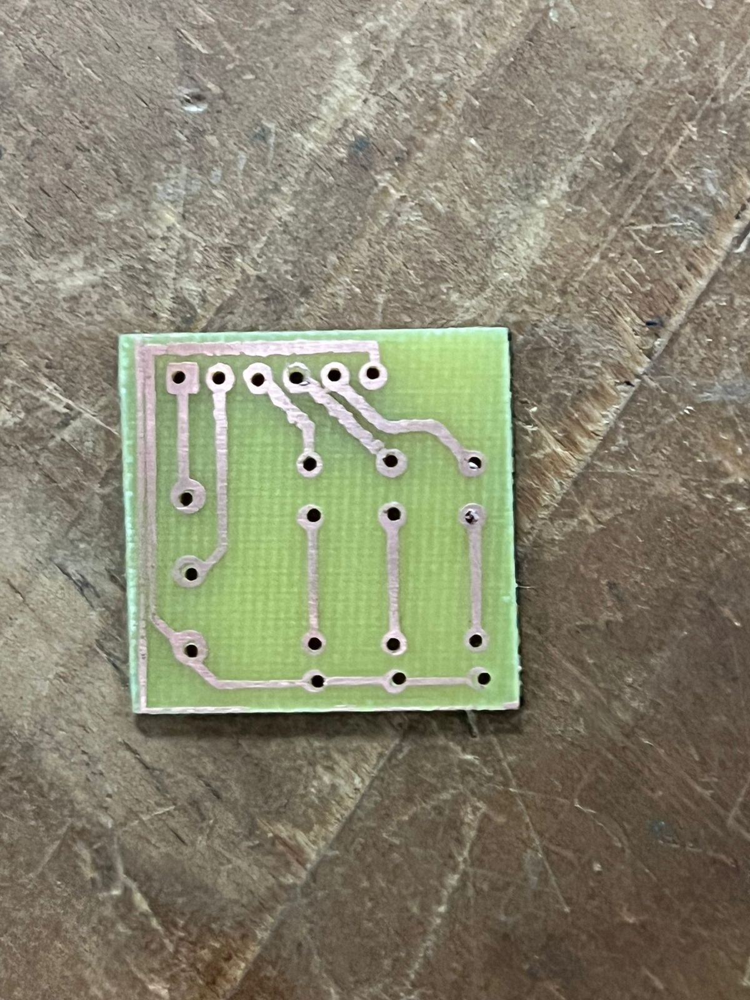

# 💧 Arduino-Based Water Level Monitoring for a Horizontal Cylindrical Tank

## 👨‍💻 Author
**Jeremy Ndirangu**

---

## 🧭 Overview
This project implements a **real-time water level monitoring system** for a **horizontally oriented cylindrical tank** using Arduino.  
It combines **geometry**, **embedded systems**, and **PCB design** to calculate water volume precisely and indicate tank levels through LEDs and optional LCD output.

---

## ✨ Features
- Simulates analog water level sensor using a **3296 trimpot (potentiometer)**  
- Calculates **water height and volume** using **circular segment geometry**  
- LED indicators for **Empty**, **Refill**, and **Full** water levels  
- Optional **16x2 LCD Display (I2C)** for live monitoring *(Serial Monitor used for testing)*  
- Custom **PCB design** created with **Eagle CAD**  
- Mathematical derivation included for accurate calibration

---

## 🧱 Folder Structure
```
├── README.md # This file
├── Arduino/ # Arduino source code
├── Schematics/ # Eagle CAD schematic and PCB layout
├── Images/ # Test setup, PCB, and Serial Monitor screenshots
├── Math/ # Mathematical derivations and calculations
├── Documentation/ # Full project report (PDF)
└── LICENSE # MIT License
```

---

## ⚙️ Hardware Used
| Component | Description |
| :--------- | :----------- |
| **Arduino Uno** | Main microcontroller board |
| **3296 Multi-turn Potentiometer** | Simulates analog water level sensor (0–5 V) |
| **LEDs (Red, Yellow, Green)** | Level indicators |
| **Resistors (220Ω)** | Current limiters for LEDs |
| **16x2 LCD Display (I2C)** | Optional live display |
| **Custom PCB** | Designed in Eagle CAD for compactness |

---

## 🔌 System Functionality
1. **Reads** analog voltage from the potentiometer (simulated sensor).  
2. **Maps** voltage to corresponding water height in the cylindrical tank.  
3. **Calculates** cross-sectional area using **circular segment geometry**.  
4. **Computes volume** (in liters) using the segment area and tank length.  
5. **Displays** computed volume on the **Serial Monitor** (or LCD).  
6. **Activates LEDs** to indicate tank status:
   - 🔴 **Empty** (≤ 1000 L)  
   - 🟡 **Refill** (1000 L < volume < 2000 L)  
   - 🟢 **Full** (≥ 4500 L)

---

## 📐 Mathematical Model

For a horizontally laid cylindrical tank:

- **Segment Area:**
  \[
  A = r^2 \cos^{-1}\left(\frac{r - h}{r}\right) - (r - h)\sqrt{2rh - h^2}
  \]

- **Volume:**
  \[
  V = A \times L
  \]

- **Conversion:**
  \[
  1\,\text{cm}^3 = 0.001\,\text{L}
  \]

📘 Detailed derivations available in  
[`Math/Calculations.pdf`](./Math/Calculations.pdf)

---

## 🧪 Testing & Results

### ✅ Serial Monitor Output


### 🧩 Schematic (Eagle CAD)


### ⚙️ Custom PCB Layout


**Observed Results:**
- Real-time volume displayed accurately on Serial Monitor.  
- LEDs switched correctly at threshold volumes:
  - **Red:** ≤ 1000 L  
  - **Yellow:** between 1000 L and 2000 L  
  - **Green:** ≥ 4500 L  
- LCD output provisioned (not tested on hardware).  

---

## 🧾 Documentation
Full detailed report available in  
[`Documentation/Water_Tank_Arduino_Report.pdf`](./Documentation/Water_Tank_Arduino_Report.pdf)

---

## 🪪 License
This project is licensed under the [MIT License](./LICENSE).  
You are free to use, modify, and distribute it.

---

### 🛠️ Designed with Engineering Precision and Practical Application in Mind
